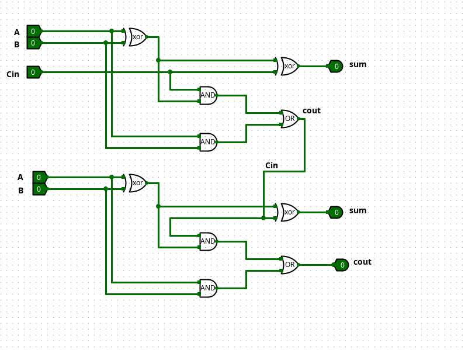

# 
# 🚧 🏗️
### ⚠️️️ This repo still In-Progress, Use with high caution ⛔
# 🚧 🏗️


# Week 1
### 1- What is the von Neumann Model/architecture?

Most computers use the stored program concept designed by mathematician John Von Neumann, which is a theoretical design describes the basic structure and functional units of a computer system. computers has five parts, an arithmetic-logic unit(ALU), control unit (CU), memory, input/output and system bus. 


### 2- When was the Von Neumann architecture invented?
1946

### 3- Has the Von Neumann Architecture been changed till recently?
The architecture still wildly used, very few use the pure model, most computers add another step to check for interrupts, electronic events that could occur any time.
it has seen many advancements such as pipelining, the introduction of RISC, parallel processing, power optimisation and many other things to improve performance and efficiency. Even though quantum computing is introduced recently it's still limited to lab use and still not production ready. 

### 4- Which computers are made from The von Neumann Model? 
The majority of computers like PC, laptops and mobile phones are based on Von Neumann model. Most intel and AMD processors are based on Von Neumann, but very few used the pure model. 

### 5- Provide the actions that a Von Newmann computer emulate.

- **instruction fetch**: obtain instructions from storage
- **instruction decode**: determine required actions and instruction size.
- **operand fetch**: locate and obtain operand data.
- **execute**: compute results 
- **result store**: deposit result into storage for later use
- **next instruction**: determine successor instruction

# Week 2:
### 1- Provide the main components of a CPU.
- **ALU**: Arithmetic logical unit: performs arithmetic and logical operations. 
- **IR**: Instruction Register: used to store the copy of currently used instruction
- **PC**: Program counter: contains the address of instruction currently used.
- **SP**: Stack pointer: contains address of the 'top' the stack
- **PS**: Processor status register: contains condition code which allow conditional jump
- **MAR**:Memory Address Register: contains the address of the memory location (RAM) to read/write
- **MBR**: Memory Buffer Register: contains data to be read/write form/to a memory location. 
- **DR**: Data Registers: storage places inside CPU where access is much faster than accessing RAM
- **XR**: Index Register: Used with high-level programming languages that use arrays.

### 2- Provide register names for Program counter in Intel/ARM processors.
In intel processor it's called **Instruction Pointer IP**.
In ARM processor it's called **Program Counter PC**.

### 3- Provide register names for storing Processor states in Intel/ARM processors?
###### In Intel processors knows as Flag Registers:
- CF: carry flag
- ZF: zero flag
- SF: sign flag
- OF: overflow flag

###### In ARM known as Program Status Registers **PSR**: 
- N: Negative
- Z: Zero
- C: Carry
- V: Overflow

### 4- Provide register names for storing the top of the Stack in Intel/ARM processors:
In Intel and ARM is called: **Stack Pointer SP**

### 5- Describe the general differences between CISC and RISC computers
- CISC (complex instruction set computer), larger number of instructions, usually 200-300, each CISC instruction can be broken down into smaller cycles to complete.
- RISC (reduced instruction set computer): smaller number (around 50) of simple instructions that execute in one cycle each. 

|   |   |   |
|---|---|---|
||CISC|RISC|
|Instruction Set <br><br>(# of instructions)|emu8086 about 130, 250-300|Less than CISC About 50|
|CPI| > 1 broken down to a<br><br>number of microinstructions<br><br>Require one or more|=1 cycle|
|Is the Length of instruction is fixed?<br><br>(# of byte / instruction)|2 bytes|4 bytes|
|Register set<br><br> (# of registers)|14 registers (emu8086)|34 or more|
|Memory access instructions<br><br> (# of instruction for memory access)|Any instruction can has one operand from memory<br><br>memory-to-memory|only 2 Load and store <br><br>memory -to- register<br><br>register-to-memory|
|Suitable for parallel processing|No, Less suitable due to more complex instructions|Yes, by using pipelining|
|Are Micro Instructions required|Yes (more complex)|No (simpler)|
|Name of the computer|Pentium 6 family|ARC, Sparc, ARM, Motorola, Power PC|


### 6- Provide the names of the computer implemented the CISC architecture...
Intel (intel 8086 such as Pentium family) and IBM mainframes

### 7- Provide the names of the computer implemented the RISC architecture...
SPARc,ARC, ARM Architecture devices extensively use RISC, MOTOROLA, Power PC

### 8- How many bits in a byte?
1 Byte = 8 bits
word = 32 bits (4 bytes) <- depends on the Architecture

### 9- How many sub buses are there in the bus system of our processor?

- #### Types of Bus:
	- data bus -> read and write *usually used to classify microprocessors i.e, 16-bit microprocessors.*
	- address bus -> transmit registers addresses
	- control bus -> control the functions of other buses.
 
### 10- How many instructions in EMU8086?
116 instructions (not sure if it's 116 or 117)

### 11-What is a combinational logic?
Translates a set of inputs (combination of inputs) into a set of outputs according to one or more mapping functions. (eg. adder)

### 12- List the characteristics of a RISC computer.
- smaller number of instructions: about 50
- simple instructions that execute in one cycle each (opposed to CISC need to be broken into micro code which require more cycles)
- RISC instructions are not interpreted
- Power efficiency 

### 13- Provide the data range ( max – min) of a 2-byte variable, 4 byte variable.
##### 2- byte
- signed: -32,768 to 32,767
- unsigned: 0 to 65,535

##### 4- byte
- signed: -2,147,483,648 to 2,147,483,647
- unsigned: 0 to 65,535

```
it can be done without memorization:
- unsigned 2-byte:
1 byte = 8 bits
2 bytes = 16 bits
2^16 = 65,536
starting from 0, therefore range: 0 - 65,535
- unsigned 4-byte:
4 bytes = 32 bits
2^32 = 4,294,967,295
starting from 0, therefore range: 0 - 4,294,967,294

- signed 2-byte:
- 2 bytes = 16 bits
- 1 bit reserved for sign: we left with 15 bits
- range is (-2^15 to 2^15 - 1) = -32,768 to 32,767

- signed 4-byte:
- 4 bytes = 32 bits
- 1 bit reserved for sign: we left with 31 bits
- range is (-2^31 to 2^31 - 1) = -2,147,483,648 to 2,147,483,647

** notes:
only need to know number of bits
signed: 2^(# of bits) and then subtract 1 since we start from 0
unsigned: 1 bit is for the sign (+-), -2^(# of bits) to 2^(# of bits) - 1
```


### 14- The data word is stored in memory as below:
Memory Addr.: value in this memory cell:
- 60012 18
- 60013 2C
- 60014 7F
- 60015 39


### What is the value represented by “Big-Endian” format and what is the value represented by “Little-Endian” format when a CPU reads the word?

- Big-Endian: 

| 60012 | 60013 | 60014 | 60015 |
|-------|-------|-------|-------|
| 18    | 2C    | 7F    | 39    |


- Little-Endian:

| 60012 | 60013 | 60014 | 60015 |
|-------|-------|-------|-------|
| 39    | 7F    | 2C    | 18   |


### 15 - An integer data in the cpu is: A1 B2 C3 D4, We want to store the data on memory, how is this data stored in memory when using Little-Endian? how is this data stored when using Big-Endian?

- Big-Endian:    A1 B2 C3 D4 (A1 is stored in the MSB)
- Little-Endian: D4 C3 B2 A1 (A1 is stored in the LSB)

### 16- A compiler designer is trying to decide between two code sequences for a particular machine. The hardware designers have supplied the following facts: For a particular high-level language, the compiler writer is considering two sequences that require the following instruction counts: What is the CPI for each sequence? Which code sequence is faster ?

$CPI1 = \dfrac{6\times2 + 7\times 5 + 5\times 6}{6+7+5} =4.2$


$CPI2 = \dfrac{3\times2 + 8\times 5 + 2\times 6}{6+7+5}=4.4$

CPIa is faster

### 17- Mean access time = c + (1 – h) * m for adding cache memory: M = 0.98ms c = 0.1ms h = 0.89 what will be the MAT? (Note: MAT= c + (1-h) * m)

$MAT=C+(1-h)\times m$
$MAT=0.1+(1-0.89)\times 0.98 =0.2078$

# Week 3

### 1- Convert 169 (base 10) to
1. base 2 notation  = 10101001
2. base 8 notation  = 251
3. base 16 notation = A9

### 2- Fraction number base conversions:
1. Convert 3.14 to its base 2 notation  = 11.0010001111
2. convert 0.628 to its base 2 notation = 0.1010000011
3. overflow/carry example as we did in class 
- Overflow
Signed Integers
(+4) + (+6)

  0100</br>
 +0110</br>
 ------</br>
 1010 = (-6) Overflow, no carry, incorrect  

- Carry</br> (-4) + (-2) </br>
	1100</br>
	1110</br>
	----</br>
	11010</br>
No overflow, carry, correct

### 3- 3. Provide the binary representation of -113 using 2’s complement notation in 8-bit notation 
- 113 = 01110001
- 2's complement: 10001111

### Find out if overflow or carry occurs in the following signed number computations using Emu8086:
###### Depends if we use 8-bit register (AL) or 16-bit registers (AX)
###### using 8-bit AL
- 127 + 3     -> No Carry, Overflow

- 127 + (-3)  -> Carry, No Overflow
- 64+5        -> No Carry, No Overflow
- (-124) +(-3)-> Carry, No Overflow
- (-64) + (-6)-> Carry, No Overflow
- 
*note🤒: week3 slide 39 Excess-127 doesn't look right*

### 4- Provide the scientific notation in Exess-50 notation as: SEEMMMMM Make sure apply normalization algorithm to maximize the precision.
1. 146.52437
2. 14.67
3. 0.001469823

##### 146.52437
- Step 1: Normalise the number by moving the decimal point to the LHS of the first digit `0.14652437 * 10^3` (explicit)
- Step 2: Determine the sign: positive `1`
- Step 3: Calculate the Exponent (E) by counting the places the decimal point moved to the right, E will be negative. If moved to the left E will be positive:  `moved to the left two places 10^3 E is 3`
- Step 4: Apply Excess-50 bias, `E + 50 = 3 + 50 = 53`
- Result: `05314652` 
- (0 is “+”, 53 is excess-50 exponent value “3”, magnitude
of mantissa is 14652)


##### 14.67
- Step 1: `0.1467 * 10^2`
- Step 2: `Positive: 1`
- Step 3: `E is 2`
- Step 4: `E + 50 = 2 + 50 =52`
- Result: `05214670`
- (0 is “+”, 52 is excess-50 exponent value “2”, magnitude
of mantissa is 14670)

##### 0.001469823
- Step 1: `0.1469823 * 10^-2` moving right
- Step 2: `Positive: 1`
- Step 3: `E is -2`
- Step 4: `E + 50 = -2 + 50 =48`
- Result: `04814698`
- (0 is “+”, 48 is excess-50 exponent value “-2”, magnitude
of mantissa is 14698)

#### Extra🤓:Represent 0.254 x 10^3 in a normalized base 8 floating point format
- Step 1:convert to base 8, `.254 * 10^3 = 254`
	- `254 / 8 = 31 R 6`
	- `31 / 8 = 3 R 7`
	- `3 /8 = 0 R 3`
	- base 8: 376
- Step 2: `positive: 1`
	- Normalise:`.376 * 8^3` <- base 8
- Step 3: `E is 3, E + 4 = 3 + 4 = 7` <- Excess-4
- Result: `073760` <- not sure why 4 digits MMMM not 5 MMMMM
- Binary representation: `0 111 011 111 110 000` <- each octet 3-bits 
scientific 
```
🤕
Class notes do not mention which normalization type is used:
example: 101.101
Implicit normalization: radix point to LHS of MSB -> 0.101101 * 2^3
Explicit normalization: radix point to RHS of MSB -> 1.01101 * 2^2

- With Scientific Notation Excess-50, explicit normatilztion is used.
- With IEEE-745, implicit normatization is used. 
- 🤕
```

### 5- a)Convert 6.28 to IEEE 754 single precision format
- convert 6 to bin: `0110`
- convert .28 to bin:
```
.28 * 2 = .56  | 0
.56 * 2 = 1.12 | 1
.12 * 2 = .24  | 0
.24 * 2 = .48  | 0
.48 * 2 = .96  | 0
.96 * 2 = 1.91 | 1
.92 * 2 = 1.84 | 1
.84 * 2 = 1.68 | 1 <- i stopped here
.
.
.
01000111
```
`
- `0110.01000111 * 2^0`
- Shift to left: `1.1001000111 * 2^2 
- Discard leading 1: `.1001000111* 2^2 
- Sign bit: `1`
- Exponent: `E is 1`
- Offset the Exponent: `2 + 127 = 129 = 10000001` 
- Result: `0 10000001 10010001110000000000000`

### b) Convert 314.628 to IEEE 754 single precision format
- convert 314 to bin: `100111010`
- convert .628 to bin: 
```
.628 x 2 = .256 | 1
.256 x 2 = .512 | 0
.512 x 2 = .024 | 1
.024 x 2 = .048 | 0
.048 x 2 = .096 | 0
.096 x 2 = .192 | 0
.192 x 2 = .384 | 0
.384 x 2 = .768 | 0 <- stopped here (not sure where we shoud stop)
.
.
.
.
00000101
```
* `100111010.10100000 * 2^0 `
* Shift point to left: `1.0011101010100000  * 2^8 `
* Discard leading 1: `.0011101010100000 * 2^8 `
* Sign bit: `1`
* Exponent: `8`
* Offset the exponent: `E+ 127 = 8 + 127 = 135 = 10000111`
* Result: `0 10000111 00111010101000000000000`

### 6- understand what is overflow/underflow, and label them on the diagram below:


- `overflow          underflow    overflow`

# Week 4

### 1- Shifter Exercise: In the below example the control C was ?
### and the shifter shifted the bits to the?
### What is the control bit to shift in the other direction?
- Control bit is : `0`
- Shift to the: `left`
- Output: `11010100`

#### In the previous example what would the OUTPUT BITS be if the INPUT BITS are: 0 0 1 1 0 1 0 1 and the control bit is 1?
- Answer: `00011010` <- will shift to the right

### Shifter Exercise: In the below example the control C was ?
### and the shifter shifted the bits to the ?
### What is the control bit to shift in the other direction?
- Control bit is: `1`
- Shift to the: `rigt`
- Output: `00110101`

#### In the previous example what would the OUTPUT BITS be if the INPUT BITS are: 0 0 1 1 0 1 0 1 and the control bit is 0?
- Answer: `01101010` <- will shift to the left

### 2- Draw a 2-bit Full-Adder using AND, XOR, and OR logic gates


### 1-bit full adder


### 3- Draw a 2-bit Shifter using AND, OR, and NOT logic gates
#### 2-bit shifter


#### 1-bit shifter


### 4- Draw an 8 bit adder from two four bit adders.


### 5- Something about AND and OR circuits but no questions 

# Week 5
### 1- Provide the unsigned integer addition of 78 and 69 in 8- bit binary format
- #### How many carry out happened in the calculation and on which bits the carry out happened


- #### How many carry in happened in the calculation and on which bit the carry in happened
- *Edit: 3 carry ins and `3` and carry outs are `2`.*

### 2- Provide the sign integer subtraction of 78 and 69 in 8-bit binary format


### 3- What is the value for the input of (ADD /SUBTRACT) to make a subtractor?


### 4- Provide the detailed calculation steps using the serial multiplier for `1011x0101`
`no clue`

### 5- Provide the detailed calculation steps using the serial divider for `111x0011`
`no clue`


### 6- Provide the calculation steps and the result where `X = 1.011*2^-5` and `Y = 1.010*2^-6`
`note: normalization format: 1.M`
X + Y
X - Y
X · Y
X / Y

#### X + y


#### X-Y


#### X · Y

= `1.101x2^-11`

#### X / Y
`not sure`

### 7- Carry-look ahead adder:


### 8- Assembly language programming.. 
#### a. Convert the following high level program to ASL in emu8086:
```C
int main(){
byte a,b,c; // make sure the variables are uninitialized...
a = 3; b = 4;
if (a > b) c = a;
	else c = b;
	return 0; // use ret for this statement...
}
```

```asm
org 100

mov al, a
mov bl, b
cmp al, bl
jp greater
mov cl, bl
jmp exit

greater: mov cl, al


exit: ret

a db 4
b db 3
c db ?
```


#### b. Convert the following high level program to ASL in emu8086:

```C
int main(){
byte s,i=0; // make sure the variables are uninitialized...

for (i=0; i<8;i++)
	s+=i;
return 0; // use ret for this statement...
```

```asm
ORG 100h
MOV bx, 1
MOV ax, 1

back:
ADD bx, 01h
ADD ax, bx
CMP bx, 8
JNE back

MOV s, ax

ret

s dw 0
```